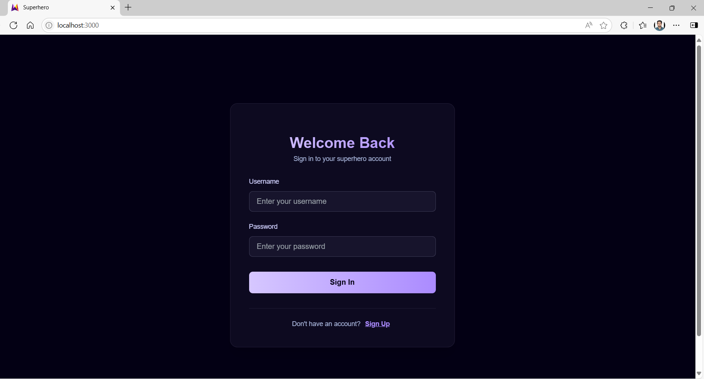
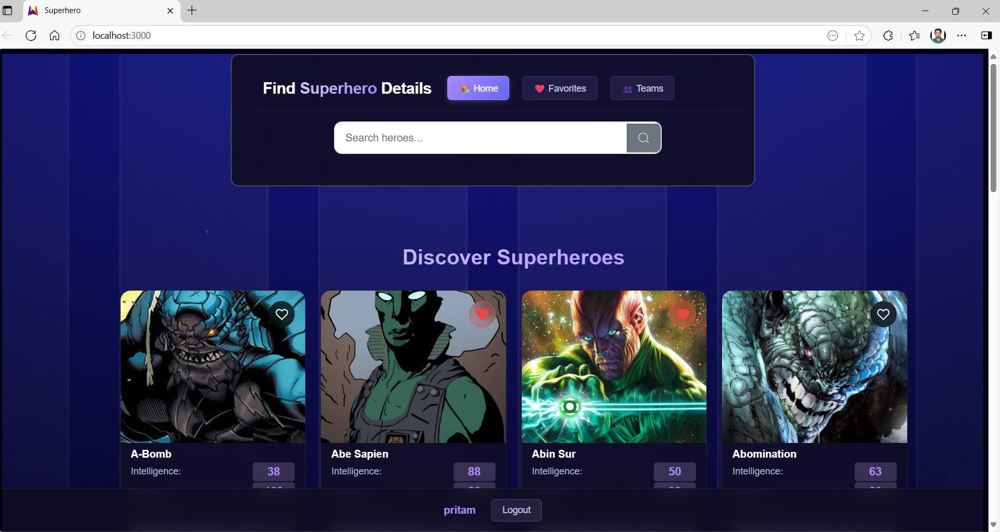
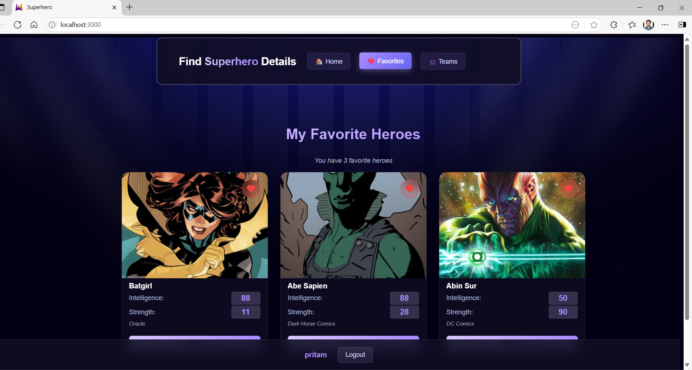

# Superhero Application

A full-stack superhero application with React.js frontend and Python FastAPI backend using SQLite database.

## 🏗️ Architecture

- **Frontend**: React.js with Vite (development) or Nginx (production)
- **Backend**: Python FastAPI with SQLite database
- **Database**: SQLite3 for data persistence
- **Containerization**: Docker & Docker Compose (optional)

## 📋 Prerequisites

Choose one of the following setups:

### For Docker Setup:
- [Docker](https://www.docker.com/get-started) (version 20.10 or higher)
- [Docker Compose](https://docs.docker.com/compose/install/) (version 2.0 or higher)

### For Local Development:
- [Python](https://www.python.org/downloads/) (version 3.8 or higher)
- [Node.js](https://nodejs.org/) (version 16 or higher)
- [npm](https://www.npmjs.com/) (comes with Node.js)

## 🚀 Quick Start

### Option 1: Docker Setup (Recommended)

#### Using Docker Compose:
```bash
# Build and start all services
docker-compose up --build

# Or run in detached mode (background)
docker-compose up --build -d
```

#### Access the Application:
- **Frontend**: http://localhost:3000
- **Backend API**: http://localhost:8000
- **API Documentation**: http://localhost:8000/docs

#### Stop the Application:
```bash
# Stop all services
docker-compose down

# Stop and remove volumes (database persists in local backend/data folder)
docker-compose down -v
```


#### Manual Setup:

**1. Backend Setup**
```powershell
# Navigate to backend directory
cd backend

# Create virtual environment
python -m venv venv

# Activate virtual environment
# Windows PowerShell:
venv\Scripts\Activate.ps1
# Windows Command Prompt:
venv\Scripts\activate.bat

# Install dependencies
pip install -r requirements.txt

# Set environment variables
$env:PYTHONPATH = "."
$env:DATABASE_PATH = "data/superheroes.db"

# Start the FastAPI server
uvicorn app.main:app --host 0.0.0.0 --port 8000 --reload
```

**2. Frontend Setup (in a new terminal)**
```powershell
# Navigate to frontend directory
cd frontend

# Install dependencies
npm install

# Start the development server
npm run dev
```

### 3. Access the Application
- **Frontend**: http://localhost:3000
- **Backend API**: http://localhost:8000
- **API Documentation**: http://localhost:8000/docs

## � Demo Screenshots

### Opening Page


### Login Page


### Dashboard


### Favorites Page


## �📁 Project Structure

```
superhero/
├── backend/
│   ├── app/
│   │   ├── main.py              # FastAPI application entry point
│   │   ├── core/
│   │   ├── db/
│   │   │   ├── sqlite_db.py     # SQLite database operations
│   │   │   └── seed.py          # Database seeding
│   │   ├── models/
│   │   ├── routes/
│   │   └── services/
│   ├── data/
│   │   └── superheroes.db       # SQLite database (persistent)
│   ├── requirements.txt         # Python dependencies
│   ├── Dockerfile              # Backend Docker configuration
│   ├── .dockerignore
│   └── venv/                    # Python virtual environment (local dev)
├── frontend/
│   ├── src/
│   │   ├── components/          # React components
│   │   ├── services/            # API service layer
│   │   └── main.jsx            # React entry point
│   ├── package.json            # Node.js dependencies
│   ├── Dockerfile              # Frontend Docker configuration
│   ├── nginx.conf              # Nginx configuration for production
│   ├── .dockerignore
│   └── node_modules/           # Node.js dependencies (local dev)
├── docker-compose.yml          # Docker services orchestration
├── start-backend.ps1           # PowerShell script to start backend
├── start-frontend.ps1          # PowerShell script to start frontend
├── start-backend.bat           # Batch script to start backend
├── start-frontend.bat          # Batch script to start frontend
└── README.md                   # This file
```

## 🗄️ Database

### SQLite Database
- **Location**: `backend/data/superheroes.db`
- **Persistence**: In Docker setup, database is mounted from local `backend/data` folder
- **Seeding**: The database is automatically seeded with superhero data on first run

### Database Operations
```powershell
# For Docker setup
docker exec -it superhero-backend python -c "from app.db.seed import seed_database; seed_database()"

# For local development
cd backend
venv\Scripts\Activate.ps1
python -c "from app.db.seed import seed_database; seed_database()"
```

## 🌐 API Endpoints

### Authentication
- `POST /auth/register` - Register new user
- `POST /auth/token` - Login and get access token

### Heroes
- `GET /heroes` - List all heroes
- `GET /heroes/{hero_id}` - Get specific hero
- `GET /heroes/search` - Search heroes
- `GET /heroes/search/suggestions` - Get search suggestions

### Users
- `GET /users/favorites` - Get user's favorite heroes
- `POST /users/favorites/{hero_id}` - Add hero to favorites
- `DELETE /users/favorites/{hero_id}` - Remove hero from favorites

### Teams
- `GET /teams/` - List user's teams
- `GET /teams/random` - Generate random team
- `GET /teams/balanced` - Generate balanced team
- `GET /teams/power-based?power={power}` - Generate power-based team
- `GET /teams/power-stats` - Get power statistics

## 🔧 Development vs Production

### Development Mode
- Frontend: Vite dev server with hot reload (port 3000)
- Backend: uvicorn with auto-reload (port 8000)
- API calls: Direct to backend (http://localhost:8000)

### Production Mode (Docker)
- Frontend: Nginx serving built React app (port 3000 → 80)
- Backend: uvicorn in production mode (port 8000)
- API calls: Through nginx proxy (/api/* → backend:8000/*)

## 🛠️ Troubleshooting

### Docker Issues

#### Port Already in Use
```bash
# Check what's using the port
netstat -tulpn | grep :3000
netstat -tulpn | grep :8000

# Stop conflicting services
docker-compose down
```

#### Database Issues
```bash
# The database persists in backend/data/, so stopping containers won't lose data
# To reset database, delete the file:
rm backend/data/superheroes.db

# Then restart:
docker-compose up --build
```

#### Container Build Issues
```bash
# Clean rebuild
docker-compose down
docker system prune -a
docker-compose up --build
```

### Local Development Issues

#### Port Already in Use
```powershell
# Check what's using the port
netstat -ano | findstr :8000
netstat -ano | findstr :3000

# Kill the process using the port (replace PID with actual process ID)
taskkill /PID <PID> /F
```

#### Python Virtual Environment Issues
```powershell
# Remove existing virtual environment
Remove-Item -Recurse -Force backend\venv

# Create new virtual environment
cd backend
python -m venv venv
venv\Scripts\Activate.ps1
pip install -r requirements.txt
```

## 🔒 Security Considerations

- JWT tokens for authentication
- Environment variables for sensitive data
- SQLite database with proper access controls
- CORS configuration for frontend-backend communication
- Nginx reverse proxy in production

## 📝 Environment Variables

### Docker (set in docker-compose.yml):
```yaml
environment:
  - PYTHONPATH=/app
  - DATABASE_PATH=/app/data/superheroes.db
```

### Local Development:
```powershell
$env:DATABASE_PATH = "data/superheroes.db"
$env:JWT_SECRET_KEY = "your-secret-key-here"
$env:PYTHONPATH = "."
```

## 🚀 Production Deployment

1. **Docker Production**: Use docker-compose with production environment variables
2. **Manual Production**: 
   - Build React app: `npm run build`
   - Use gunicorn for FastAPI
   - Use production database (PostgreSQL/MySQL)
   - Add SSL certificates
   - Configure proper logging

## 📄 License

This project is for educational purposes.

## 🤝 Contributing

1. Fork the repository
2. Create your feature branch (`git checkout -b feature/AmazingFeature`)
3. Commit your changes (`git commit -m 'Add some AmazingFeature'`)
4. Push to the branch (`git push origin feature/AmazingFeature`)
5. Open a Pull Request

---

**Happy coding! 🦸‍♂️🦸‍♀️**
g